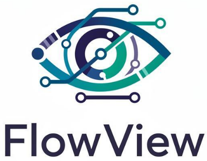

# Place Publique

## Résumé
Nous sommes trois ingénieurs Data/IA
spécialisés en vision par ordinateur, travaillant pour FlowView, une startup
innovante spécialisée dans l'analyse vidéo intelligente. L'entreprise, créée il y
a 3 ans, a déjà réalisé plusieurs PoC (Proof of Concept) pour des clients
pilotes, mais souhaite désormais passer à l'échelle en mettant en commun
les éléments génériques de son produit Place-Publique.

