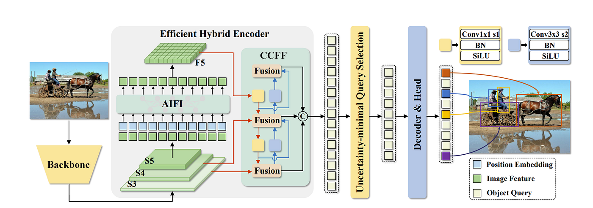

Choix des modèles et performances
1. Quels sont aujourd’hui les principaux modèles de détection d’objets
utilisés en vidéosurveillance (YOLOv8/YOLO11, Faster R-CNN, DETR, etc.)
et quels compromis font-ils entre vitesse d’inférence, précision (mAP)
et consommation de ressources pour un déploiement temps réel sur du
matériel limité ?

**Answer:**

quelques modèles envisagés:

Principalement les modèles ultralytics autours des 100mo

yolo11 (plusieurs variantes pour chaque version de yolo s, n, x ...)
yolo11x semble le plus approprié, on peut également essayer les modèles -seg qui délimite plus proprement les bounding boxs autour des contours de l'objet observé
Les modèles de la séquence rtdetr

Et potentiellement plus performants encore, meta propose les modèles de la série SAM,
SAM3 un modèle plus volumineux (2+go, 0.9B parameters)

Recommandation de tester Resnet 16 ?

DETR semble également intéressant,

    Il faut en principe trouver un modèle qui propose un compromis intéressant entre performance, rapidité d'inférence et ressources à disposition tout en étant cohérent avec le timer qu'on s'est imposé en baseline. On doit s'assurer que si on s'est fixé l'analyse d'une image d'un feed continue toutes les 5 secondes, l'outil aura bien eu le temps de récupérer et traiter l'image.

    L'objectif pour nous serait de prompt en direct quel objet (poisson) observer et segmenter

-----

2. Quelles bonnes pratiques permettent d’évaluer rigoureusement un
modèle de détection d’objets sur des scènes de caméras fixes
(métriques mAP, précision/rappel par classe, IoU, analyse d’erreurs)
afin de garantir la fiabilité des statistiques de comptage dans des
conditions réelles (jour/nuit, pluie, foule dense) ? Données, annotation et robustesse

**Answer:**

Pour évaluer rigoureusement un modèle de détection sur caméras fixes :
Métriques principales :

mAP@0.5 et mAP@0.5:0.95 pour la performance globale
Précision/Rappel par classe pour identifier les classes problématiques si on en choisit plusieurs et pas uniquement poisson
Courbes PR (AUC/ROC) pour optimiser le seuil de confiance selon l'usage (comptage dans notre cas = privilégier le rappel)

Validation contextuelle :

Prise en compte de différents facteurs (jour/nuit, météo, densité de foule qui nous paraît être un programme majeur)
Analyse d'erreurs comme les faux positifs
Ground truth : comparer les comptages sur séquences vidéo vs comptage manuel

Spécificités caméras fixes :

Test sur zones pertinentes pour le comptage, conserver les mêmes dimensions d'images
Analyse de dérive de modèle potentiel : performance sur longues périodes pour détecter les dégradations (changements de luminosité ou autres)

Hors du scope:

On aurait aimer faire du tracking mais c'est peu réaliste

-----

3. Comment sélectionner, combiner et annoter des datasets (Roboflow
Universe, datasets de trafic, webcams publiques) pour couvrir la
variété des contextes clients (places, ports, stations de ski) tout en contrôlant la taille du dataset pour un entraînement faisable sur
laptop/Colab ?

**Answer:**

Sélection stratégique :

Prioriser la qualité sur la quantité : On espère que 40-100 images annotées suffisent pour du fine-tuning correcte
Roboflow Universe : filtrer par similarité visuelle (caméras fixes, conditions météo, angles de vue)
live feed accessible 24/24h : extraire des frames à intervalles réguliers (toutes les 5s-10s) et s'assurer de la disponibilité

Stratégie d'annotation :

Annotation par prompt : SAM2 ou Grounding DINO pour segmenter en spécifiant l'objet textuellement ("poisson")
Focus sur cas difficiles : luminosité, densité de population
Validation croisée : 70/20/10 (train/val/test)

Contraintes techniques :

Capacités et temps d'entraînement
Augmentation de données possible (rotation et luminosité)
Transfer learning : partir de modèles pré-entraînés (YOLO, RT-DETR, SAM...) pour réduire les besoins en données, dans notre cas les poissons ne sont littéralement jamais détectés donc tout est a faire.

-----

4. Quelles stratégies d’augmentation de données et d’adaptation de
domaine (changement de météo, saison, angle de caméra, résolution)
sont pertinentes pour améliorer la robustesse d’un modèle de détection
appliqué à des flux webcams hétérogènes et évolutifs ?

**Answer:**

Dans notre cas ça se résume principalement à l'orientation vu les déplacements variés de poissons en milieux aquatiques, recadrage et jouer sur la luminosité et les floux mêmes si les conditions devrait rester assez consistantes dans un aquarium de jour. Architecture logicielle, DataOps et MLOps

Plus généralement:

Augmentations essentielles :

- Luminosité/contraste : simuler jour/nuit, couchers de soleil, ombres (crucial pour flux 24/24h)
- Conditions météo : ajout de pluie, brouillard, neige synthétique via albumentations
- Flou et compression : dégradation qualité pour simuler bande passante variable des webcams
- Recadrage aléatoire : compenser les variations de zoom et angles entre caméras fixes

Adaptation de domaine :

- Fine-tuning progressif : ré-entraîner sur échantillons du flux cible toutes les semaines/mois
- Normalisation adaptative : ajuster preprocessing selon statistiques du flux (luminosité moyenne, résolution native)
- Détection de drift : monitorer confiance moyenne et alerter si chute significative (changement saison, repositionnement caméra)

Contraintes pratiques :

- Augmentations légères uniquement : éviter transformations irréalistes qui nuisent au fine-tuning avec peu de données
- Prioriser augmentations temporelles : variation luminosité horaire observée sur le flux réel
- Pipeline automatisé : capturer conditions rares (tempête, nuit complète) et les intégrer au dataset d'entraînement continu

-----

5. Quelles architectures applicatives sont les plus adaptées pour relier
flux vidéo, service d’inférence, base de données temporelle et frontend
(Flask) : traitement batch périodique vs quasi temps réel, microservices,
file de messages, et quels impacts sur la scalabilité et la tolérance aux
pannes ?

**Answer:**

Architecture choisis par nos soins  :

- Hypercorn maintient la gestion synchrone et asynchrone des différents composants de l'app, Timer en Cron, tech autour de gunicorn avec File System pour conserver la db running quand le docker est stop, orchestrateur d'instances dockeurs aux tâches spécifiques et flux caméra multiples inégrables, système de Queue en cas de latence temporaire.
- Quasi temps réel suffisant : latence 5-10s acceptable pour une tâche de comptage.
- Prioriser fiabilité sur vitesse : On est prêt à faire des concessions sur le temps d'inférence pour utiliser des modèles plus volumineux
Mais fondamentalement:

Architecture recommandée :

- Traitement batch périodique (toutes les 5-10s) : cohérent avec notre baseline, réduit charge CPU et évite traitement inutile de frames identiques
- File de messages (Redis/RabbitMQ) : découpler capture → inférence → stockage, permet retry en cas d'échec
- (Eventuellement) Base temporelle (InfluxDB/TimescaleDB) : optimisée pour séries temporelles (comptages, détections par intervalle)
- Hypercorn: Flask + cache : servir statistiques pré-calculées, éviter requêtes lourdes en temps réel

Scalabilité et résilience :

- Workers d'inférence indépendants : ajouter capacité sans toucher au reste (horizontal scaling)
- Stockage intermédiaire : frames dans Redis/S3 si inférence ralentit, évite perte de données
- Fallback gracieux : si service d'inférence tombe, continue capture et traite en différé
- Monitoring : alertes sur latence inférence, queue size, disponibilité webcam

-----

6. Quels outils et patterns MLOps (MLflow, CI/CD, versioning de modèles,
tests automatisés) sont recommandés pour assurer un cycle de vie
maîtrisé des modèles de détection d’objets, depuis l’expérimentation
jusqu’au déploiement reproductible en production (Docker, cloud/on
premise) ? Monitoring, dérive et réentraînement

**Answer:**

Il est avant tout nécessaire d'avoir une architecture résiliente d'un modèle qui relance un nombre de fois définis une instance qui est down et qui en cas d'échec alerte les équipes.
Il en découle qu'il est important de pouvoir conserver les logs de fonctionnement de l'architecture docker mais également ceux des instances qui font tourner les différents composants de l'app depuis le docker compose.

On s'assure d'avoir une évaluation continu du modèle post déploiement pour alerter le client d'un éventuel data drift. Ainsi qu'avoir un fallback efficace vers une version précédente de l'application si le déploiement de la nouvelle se passe mal.

Ensuite, il faut industrialiser tout le cycle de vie :
	•	Tracking & registry (MLflow) : journaliser métriques (mAP, PR par classe), hyperparamètres, artefacts (poids, config), et enregistrer les modèles dans un Model Registry avec statuts (staging/production) pour des promotions contrôlées.
	•	Versioning complet : versionner code + données + annotations + configs + modèle (Git + DVC/Delta Lake, conventions de version sémantique) afin de pouvoir reproduire un entraînement et diagnostiquer une régression.
	•	CI/CD : pipeline automatisé (GitHub Actions/GitLab CI) qui exécute :
	•	tests unitaires (pré/post-traitements, NMS, conversion formats),
	•	tests de données (schéma, distributions, classes manquantes, images corrompues),
	•	tests de performance (garde-fous mAP / rappel min par classe),
	•	tests d’inférence (latence, mémoire, compatibilité GPU/CPU),
puis build Docker, scan sécurité, et déploiement (K8s/compose) avec stratégie canary/blue-green.
	•	Patterns de déploiement : séparation claire training / serving, API de prédiction stateless, batch vs temps réel, et “shadow mode” pour comparer un nouveau modèle sans impacter la prod.
	•	Monitoring :
	•	système (CPU/GPU, RAM, latence, taux d’erreur),
	•	données (drift covariate, qualité image, proportions de classes),
	•	modèle (taux de détection, confiance moyenne, distribution des scores, suivi du rappel sur échantillons labellisés),
avec alertes et tableaux de bord.
	•	Dérive & réentraînement : définir des seuils (drift, baisse de rappel sur classes critiques), déclencher une boucle de re-labellisation ciblée + réentraînement, puis validation et promotion via le registry.

En résumé : traçabilité (MLflow + versioning), automatisation (CI/CD + tests), déploiement reproductible (Docker/K8s), et monitoring/drift → réentraînement pour une prod maîtrisée.

-----

7. Quelles métriques et quels signaux (statistiques de distribution, taux
de détection, feedback utilisateur, anomalies sur les séries temporelles
de comptage) permettent de détecter efficacement la dérive de
données ou de concepts dans un système de vidéosurveillance
algorithmique, et comment déclencher un processus de
réentraînement pertinent ? Détection de dérive (data & concept drift)

**Answer:**

Métriques & signaux
	•	Statistiques de distribution : PSI, KS, JS divergence sur pixels, embeddings visuels, tailles/ratios des bbox, luminosité, angle caméra.
	•	Taux de détection : variation du nombre d’objets par frame/minute, chute du rappel estimé, baisse de la confiance moyenne.
	•	Stabilité par classe : déséquilibre soudain des proportions, classes manquantes ou nouvelles confusions.
	•	Séries temporelles de comptage : ruptures, tendances anormales, saisonnalité cassée (z-score, CUSUM, change point).
	•	Feedback utilisateur / labels faibles : corrections humaines, faux positifs/négatifs signalés.
	•	Performance proxy : latence, taux d’échec d’inférence (souvent corrélés à des changements de données).

Déclenchement du réentraînement
	•	Seuils automatiques (ex. PSI > 0,2, chute > X % du rappel sur classes critiques).
	•	Confirmation via échantillonnage et labellisation ciblée des cas anormaux.
	•	Réentraînement incrémental ou complet, validation hors-ligne (mAP, rappel par classe), puis déploiement canary avant promotion en production.

-----

8. Quelles approches existent pour intégrer le monitoring de modèles
(MLflow, dashboards, alertes) dans une application de vision par
ordinateur en production, afin de suivre à la fois la qualité des
prédictions et la santé opérationnelle du pipeline de traitement vidéo ? RGPD, AI Act et éthique

**Answer:**

En production, le monitoring d’un modèle de vision par ordinateur repose sur une combinaison d’outils et de bonnes pratiques.

D’abord, des outils comme MLflow permettent de suivre les métriques du modèle (mAP, taux de détection, confiance moyenne) et de comparer les versions déployées. Ces métriques sont exposées dans des dashboards (Grafana/Prometheus) pour surveiller à la fois la qualité des prédictions et la santé du pipeline (latence, débit vidéo, erreurs, usage GPU/CPU). Des alertes sont configurées en cas de dérive de données, de baisse de performance ou d’incident système.

Ensuite, des signaux comme l’évolution des distributions de comptage, notamment, les variations de comptage ou le feedback utilisateur permettent de détecter une dérive et de déclencher un réentraînement.

Le monitoring doit également respecter le RGPD et l’AI Act : minimisation des données personnelles, anonymisation (floutage, pas de stockage vidéo inutile), traçabilité des modèles et décisions, transparence et contrôle des biais pour garantir une utilisation éthique du système.

-----

9. Comment les cadres réglementaires RGPD et AI Act classifient-ils les
systèmes de vidéosurveillance algorithmique, quelles obligations en
découlent (base légale, DPIA, registres, transparence) et quelles
pratiques techniques (anonymisation, absence de stockage vidéo,
agrégation) sont recommandées pour rester conforme ?

**Answer:**

Les systèmes de vidéosurveillance algorithmique sont fortement encadrés par le RGPD et l’AI Act en raison de l’utilisation de données personnelles.

Dans notre cas il ne s'agit que d'une expérience éducative mais il ne faut pas négliger les droits des poissons.

Plus généralement dans un cadre qui implique des individus dotés de droits devant la société:

Le RGPD impose une base légale claire (intérêt légitime, obligation légale…), la réalisation d’une DPIA (analyse d’impact), la tenue de registres de traitement, ainsi que des obligations de transparence envers les personnes filmées (information, droits d’accès et d’opposition).

L’AI Act classe la plupart des systèmes de vidéosurveillance algorithmique comme des systèmes à haut risque, notamment lorsqu’ils sont utilisés dans l’espace public, impliquant des exigences renforcées : gestion des risques, traçabilité, qualité des données, supervision humaine et documentation.

Pour rester conforme, des pratiques techniques sont recommandées : anonymisation ou pseudonymisation (floutage des visages), absence ou limitation du stockage vidéo, traitement en temps réel, et agrégation des résultats (comptage plutôt qu’identification), afin de réduire l’impact sur la vie privée et les risques éthiques.

-----

10. Quels sont les principaux enjeux éthiques liés au comptage
automatisé de personnes et de véhicules dans l’espace public (risque
de surveillance de masse, biais sur certaines populations, réutilisation
des données) et quelles mesures de conception (privacy by design, limitation des finalités, gouvernance des modèles) peuvent en limiter les risques ?

**Answer:**

Le comptage automatisé de personnes et de véhicules dans l’espace public pose plusieurs enjeux éthiques.

Il existe d’abord un risque de surveillance de masse, même sans identification directe, si les systèmes sont généralisés ou détournés de leur finalité initiale. Des biais algorithmiques peuvent aussi affecter certaines populations ou types de véhicules selon les contextes (conditions d’éclairage, apparence, densité). Enfin, la réutilisation des données à d’autres fins que le comptage (sécurité, contrôle) peut porter atteinte aux libertés individuelles.

Pour limiter ces risques, il est recommandé d’appliquer le privacy by design (anonymisation, floutage, traitement en temps réel), de limiter strictement les finalités et la durée de conservation des données, et de mettre en place une gouvernance des modèles (documentation, audits, supervision humaine) afin de garantir un usage responsable et éthique.

---
11. Comment passer d’un détecteur « fermé » classique (qui choisit toujours une classe connue) à une approche d’open‑set object detection capable de signaler des objets inconnus ou « autre » dans une scène réelle de vidéosurveillance ? 
**Answer:**

On passe du closed-set à l’open-set en ajoutant un mécanisme de rejet : seuil de confiance, estimation d’incertitude ou détection d’outliers dans l’espace des embeddings. L’objectif est de permettre au modèle de dire « je ne sais pas » au lieu de forcer une classe connue.

---
12. Quelles stratégies (seuils de confiance, incertitude, bruit de fond, pseudo‑labels, zones d’attention) permettent de distinguer un vrai « objet inconnu » d’un simple faux positif ou d’un bruit de fond dans un modèle de détection ? 
**Answer:**

On combine plusieurs signaux : score faible, forte incertitude, incohérence temporelle (objet vu une seule frame) et énergie élevée. Un vrai objet inconnu est généralement stable dans le temps et spatialement cohérent, contrairement au bruit.

---
13. Comment exploiter les objets détectés comme « inconnus/autre » pour déclencher un processus de ré‑annotation / ré‑entraînement, et transformer progressivement ces inconnus en nouvelles classes utiles pour le client (nouveaux types de véhicules, engins de chantier, équipements saisonniers, etc.)? 
**Answer:**

Les objets marqués « unknown » sont stockés, clusterisés automatiquement, puis annotés par un humain. Ils sont ensuite intégrés au dataset et le modèle est ré-entraîné, ce qui transforme progressivement les inconnus en nouvelles classes.

---
14. Quelles métriques ou protocoles d’évaluation spécifiques à l’open‑set (taux de détection d’inconnus, calibration de la confiance, analyse des erreurs sur les classes « autre ») peut‑on utiliser pour juger la robustesse réelle du système dans un environnement ouvert ? 
**Answer:**

On utilise des métriques spécifiques comme l’AUROC OOD, l’Open-Set Error et l’Expected Calibration Error. Elles mesurent la capacité du modèle à rejeter l’inconnu tout en restant fiable sur le connu.

---
15. Pourquoi le serveur intégré de Flask n’est‑il pas une solution adaptée à la production (concurrence limitée, pas de gestion robuste des workers, absence de fonctionnalités avancées de log et de monitoring) et en quoi un serveur WSGI comme gUnicorn répond‑il à ces limites? 
**Answer:**

Le serveur Flask est mono-processus et instable en charge. gUnicorn gère plusieurs workers, les redémarrages automatiques et la concurrence, ce qui en fait une vraie solution de production.

---
16. Comment architecturer un déploiement typique Flask + gUnicorn (+ éventuellement Nginx) : rôle de chaque composant, gestion des workers, équilibrage de charge, gestion des timeouts pour les requêtes d’inférence lourdes (vision par ordinateur)? 
**Answer:**

Nginx sert de reverse proxy et gère HTTPS. gUnicorn gère les workers Python. Flask contient la logique métier et l’inférence du modèle.

---
17. Quelles options de configuration gUnicorn (nombre de workers, worker class sync / gevent, limites de temps, logs) sont particulièrement critiques pour une API de détection d’objets qui doit traiter simultanément plusieurs flux webcams? 
**Answer:**

Les paramètres critiques sont le nombre de workers, le timeout élevé pour l’inférence, et le type de worker (sync ou gevent). Ils déterminent directement la latence et la stabilité du service.

---
18. Comment intégrer gUnicorn dans la chaîne CI/CD existante du projet (Dockerfile, commande d’entrée, health checks) afin de passer facilement d’un serveur de dev Flask à un service de prod reproductible? 
**Answer:**

gUnicorn est lancé dans le Dockerfile comme point d’entrée. Le pipeline CI construit l’image, lance les tests et déploie automatiquement sur le cluster.

---
19. Quelles sont les principales options de déploiement d’un service de vision par ordinateur dans le cloud (VM classique, conteneur Docker sur Kubernetes, serverless type Lambda/Cloud Functions, endpoints managés type Vertex AI / SageMaker) et quels sont leurs avantages / limites pour un traitement de flux vidéos périodiques ou temps quasi réel ? 
**Answer:**

Les conteneurs sur Kubernetes sont le meilleur compromis entre flexibilité, performance GPU et scalabilité. Les solutions serverless sont peu adaptées aux flux vidéo continus.

---
20. Comment concevoir une architecture scalable où le service d’inférence est conteneurisé (Docker) et déployé sur un orchestrateur (Kubernetes, ECS, AKS, GKE) afin d’ajuster automatiquement le nombre de workers de détection en fonction du nombre de webcams et du volume de requêtes ? 
**Answer:**

Chaque pod contient un modèle. Un autoscaler ajuste le nombre de pods en fonction du nombre de requêtes ou de l’usage GPU.

---
21. Dans quels cas un déploiement « edge » (Docker sur une machine sur site, cluster on‑premise) est‑il préférable au full cloud pour ce type d’application (latence, confidentialité, coûts de bande passante) et comment intégrer cette contrainte dans l’architecture proposée pour ce projet? 
**Answer:**

Le edge est préférable quand la latence, la confidentialité ou les coûts réseau sont critiques. On garde alors l’inférence sur site et le cloud pour le monitoring et le retraining.

---
22.Quelles bonnes pratiques de monitoring et d’observabilité cloud (logs centralisés, métriques, traces, dashboards) doit‑on ajouter à MLflow pour suivre à la fois la santé du cluster (CPU/GPU, mémoire) et la qualité des prédictions (drift, erreurs, temps de réponse) à grande échelle ?
**Answer:**

On surveille à la fois l’infrastructure (CPU/GPU, RAM, latence) et le modèle (drift, taux d’unknown, distribution des scores). Sans observabilité, un système IA en production devient rapidement aveugle.